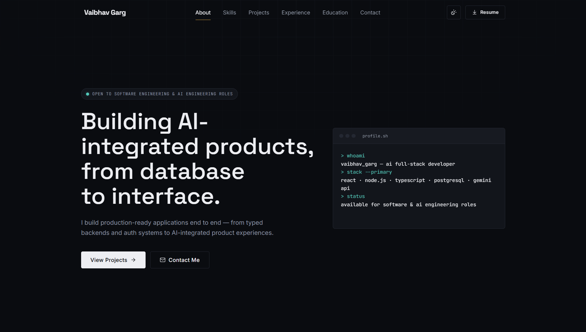

<h1 align="center">Vaibhav Garg</h1>

<p align="center">
  <strong>AI Full-Stack Developer | B.Tech (ECE) @ LNMIIT Jaipur</strong>
</p>

<p align="center">
  
  
  
  
</p>

<p align="center">
  
</p>

This repository contains the source code for my personal portfolio website, where I showcase my projects, technical skills, internship experience, achievements, and contact information. My work primarily focuses on AI-powered applications, scalable backend systems, secure authentication, and modern full-stack development.


## 🌐 Live Portfolio

**https://portfolio-vbv18.vercel.app**

---

## About Me

I'm an AI Full-Stack Developer who enjoys building scalable web applications, secure backend systems, and AI-powered developer tools. I enjoy turning complex ideas into production-ready software while focusing on clean architecture, performance, and user experience.

Currently pursuing a B.Tech in Electronics & Communication Engineering at **The LNM Institute of Information Technology (LNMIIT), Jaipur**.

---

## 🚀 Highlights

- 🤖 Building AI-powered applications using modern LLMs
- 💻 Developing scalable full-stack applications with React, Node.js, and TypeScript
- 🔐 Experience designing secure authentication and session management systems
- 🛰 Internship at Bharat Electronics Limited (BEL), working with ASTERIX CAT048 radar communication
- 🏆 AIR 2217 in GATE 2026 (EC) and Top 12 Finalist in the ChipIN Design Hackathon

---

## 💼 Experience

### Internship Trainee | Bharat Electronics Limited (BEL), Ghaziabad
**June 2025**

Worked on aviation surveillance systems by analyzing and decoding **ASTERIX CAT048 radar packets**, gaining practical exposure to real-time defense communication protocols and structured binary data processing.

**Key Contributions**
- Analyzed ASTERIX CAT048 radar packets used in air surveillance systems.
- Studied aviation communication protocols and standardized packet structures.
- Gained hands-on exposure to real-time data processing and defense-grade communication systems.
- Strengthened understanding of networking protocols, binary data parsing, and low-level communication formats.

---

## Projects

My latest and featured projects are available on my portfolio website:

🌐 **https://portfolio-vbv18.vercel.app**

---

## Technical Skills

### Languages

- TypeScript
- JavaScript
- Python
- C++
- HTML
- CSS

### Frontend

- React
- Next.js
- Tailwind CSS

### Backend

- Node.js
- Express.js
- REST APIs
- JWT Authentication

### Databases

- PostgreSQL
- MongoDB
- Prisma
- Supabase
- Mongoose

### AI

- Gemini API
- Groq API
- LLM Integration
- Prompt Engineering

### Tools

- Git
- GitHub
- Turborepo
- Clerk
- Arcjet
- Postman
- Zod

---

## Achievements

- AIR 2217 — GATE 2026 (EC)
- Top 12 Finalist — ChipIN Design Hackathon 2025
- Ranked among the Top 7% at LNMIIT
- Top 70/400 — eLitmus Assessment
- 96.20 percentile in JEE Main (99.21 percentile in Physics)

---

## Contact

📧 Email: 23uec638@lnmiit.ac.in

💼 LinkedIn: https://linkedin.com/in/vbvgarg

💻 GitHub: https://github.com/vbv18

🌐 Portfolio: https://portfolio-vbv18.vercel.app

---

## Running Locally

```bash
git clone https://github.com/vbv18/portfolio.git

cd portfolio

npm install

npm run dev
```

---

## Let's Connect

I'm always open to discussing software engineering, AI, full-stack development, internships, and exciting opportunities.

If you have an opportunity or would like to collaborate, feel free to reach out through LinkedIn or email.

---

## 📄 License

This project is licensed under the MIT License. See the [LICENSE](LICENSE) file for details.
